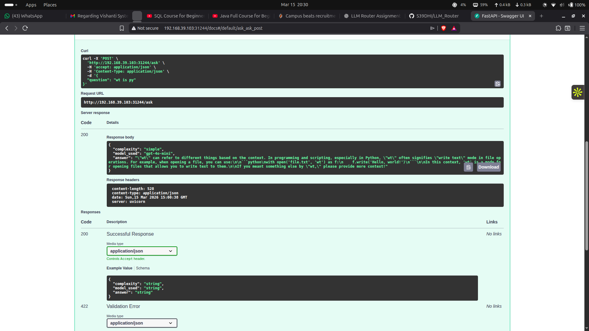
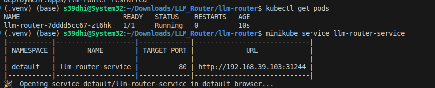

# LLM Router Service

## Project Description
A FastAPI service that receives a user question, classifies its complexity, routes the query to the appropriate LLM model, and returns the answer along with metadata about the routing decision.

The system is designed to balance **cost and performance** by dynamically selecting the most suitable model based on query complexity.

📄 **Detailed Routing Logic Document**

[View Full PDF Explanation](images/router_llm.pdf)

Tested With:
- Python 3.11
- Docker
- Minikube
- Kubernetes

<p align="center">
  
</p>

---

## Table of Contents

1. [System Architecture](#system-architecture)
2. [Running Locally](#running-locally)
3. [Running with Docker](#running-with-docker)
4. [Kubernetes Deployment](#kubernetes-deployment)
5. [Routing Logic](#routing-logic)
6. [Example Request and Response](#example-request-and-response)

---

# System Architecture

The service is implemented using multiple modular components. Each component handles a specific responsibility in the routing pipeline.

## System Flow

```
User Question
↓
FastAPI Endpoint (/ask)
↓
Query Classifier
↓
Model Router
↓
OpenAI API
↓
Return Response JSON
```

## Project Structure

```
app/
 ├── main.py
 ├── classifier.py
 ├── router.py
 ├── llm_client.py
 └── schemas.py
```

## FastAPI Entry Point (`main.py`)

This file contains the main API endpoint.

```
POST /ask
```

Responsibilities:
- Receives the user question
- Sends the question to the classifier
- Uses the router to select the appropriate model
- Calls the LLM client
- Returns the final response

---

## Query Classifier (`classifier.py`)

The classifier determines the complexity of the question using **custom heuristics designed in this project**.

Instead of using a machine learning model, a rule-based heuristic approach is implemented that evaluates multiple signals from the question.

The classifier analyzes:

1. **Query length**
2. **Keyword signals**
3. **Multi-part question structure**

Keywords are grouped into different categories:

### Complex Keywords
Example words indicating technical complexity:

```
architecture
distributed
scalable
system
pipeline
microservices
kubernetes
optimization
performance
algorithm
```

### Reasoning Words

```
why
how
explain
analyze
evaluate
```

### Comparison Words

```
compare
difference
vs
versus
```

### Task Words

```
design
build
implement
create
develop
```

### Heuristic Scoring

Each signal increases the classification score.

Example signals:
- Long query
- Multiple keywords detected
- Multi-part questions

Classification result:

```
Score ≤ 1  → Simple
Score ≤ 3  → Medium
Score > 3  → Complex
```

This approach allows building a lightweight classifier without training data.

---

# Running Locally

## 1 Clone Repository

```bash
git clone https://github.com/S39DHI/LLM_Router.git
cd LLM_Router
```

## 2 Create Environment File

```bash
cp .env.example .env
```

Add your API key inside `.env`

```
OPENAI_API_KEY=your_openai_api_key
```

## 3 Install Dependencies

```bash
pip install -r requirements.txt
```

## 4 Run API

```bash
uvicorn app.main:app --reload
```

## 5 Access API

```
http://127.0.0.1:8000/docs
```

FastAPI automatically provides interactive Swagger documentation.

---

# Running with Docker

The project includes a Dockerfile to containerize the FastAPI application.

## Important Note About `.dockerignore`

In production systems, sensitive files such as `.env` should **not be included in the Docker image**.

Therefore `.env` is typically added to `.dockerignore`.

Example `.dockerignore` entry:

```
.env
```

This prevents the API key from being copied into the image.

However, for this assignment the `.env` file may still exist locally for testing.

---

## 1 Build Docker Image

```bash
docker build -t llm-router .
```

Verify image:

```bash
docker images
```

---

## 2 Run Container

Instead of copying the `.env` file into the image, environment variables are passed during runtime.

```bash
docker run -p 8000:8000 --env-file .env llm-router
```

This securely provides the OpenAI API key to the container.

---

## 3 Access API

```
http://localhost:8000/docs
```

---

# Kubernetes Deployment

The project can also be deployed using Kubernetes.

For **local development and testing**, Minikube is used.

In real production environments, Kubernetes clusters can be deployed on cloud providers such as:

- AWS (EKS)
- Google Cloud (GKE)
- Azure (AKS)

---

## 1 Start Minikube

```bash
minikube start
```

---

## 2 Configure Docker for Minikube

This allows Docker images to be built directly inside the Minikube cluster.

```bash
eval $(minikube docker-env)
```

---

## 3 Build Docker Image

```bash
docker build -t llm-router .
```

Verify:

```bash
docker images
```

---

## 4 Create Kubernetes Secret

Store the OpenAI API key securely.

```bash
kubectl create secret generic openai-secret \
  --from-literal=api-key=YOUR_OPENAI_API_KEY
```

Verify:

```bash
kubectl get secrets
```

---

## 5 Deploy Application

```bash
kubectl apply -f k8s/deployment.yaml
kubectl apply -f k8s/service.yaml
```

---

## 6 Check Pods

```bash
kubectl get pods
```

Expected:

```
llm-router-xxxxx   1/1   Running
```

---

## 7 Check Service

```bash
kubectl get svc
```

Example:

```
llm-router-service   NodePort   10.xx.xx.xx   80:31244/TCP
```

---

## 8 Access API

```bash
minikube service llm-router-service
```

Example URL

```
http://192.168.39.103:31244/docs
```

This opens the FastAPI Swagger UI.

<p align="center">
  
</p>

---

# Example Request and Response

## Example Request

POST `/ask`

```bash
curl -X POST "http://127.0.0.1:8000/ask" \
-H "Content-Type: application/json" \
-d '{"question": "Explain Kubernetes pods"}'
```

JSON body:

```json
{
 "question": "Explain Kubernetes pods"
}
```

---

## Example Response

```json
{
 "complexity": "simple",
 "model_used": "gpt-4o-mini",
 "answer": "A Kubernetes Pod is the smallest deployable unit..."
}
```

---

# Routing Logic

### Design Consideration: RouteLLM

During the design phase, frameworks such as **RouteLLM** were considered.

RouteLLM uses embedding-based routing, where queries are converted into vector embeddings and compared against routing policies or examples to determine the most appropriate LLM model.

While this approach can provide strong routing accuracy, it introduces additional complexity such as embedding models and similarity computations.

For this implementation, a **custom heuristic-based router** was chosen instead. This keeps the system lightweight, interpretable, and easy to modify while still demonstrating the core principles of LLM routing.

The routing system consists of two main stages:

1. **Complexity Classification**
2. **Model Routing**

---

## Query Classifier (`classifier.py`)

The classifier is responsible for analyzing the incoming user question and determining its **complexity level** before the request is routed to a specific LLM model.

Instead of using a machine learning model, this project implements a **rule-based heuristic classifier**. The goal of this approach is to keep the system lightweight, interpretable, and easy to extend without requiring training data.

The classifier evaluates several signals extracted from the input query. Each signal contributes to a **heuristic score**, which is then used to determine the final complexity category.

---

### Design Goals

The classifier was designed with the following goals:

- **Low latency** – classification should be extremely fast.
- **Explainability** – the reasoning behind classification should be transparent.
- **Extensibility** – new rules and keywords can be added easily.
- **No training data required** – avoids the need for datasets or model training.

---

### Signals Used for Classification

The system evaluates multiple indicators to determine the complexity of a question.

#### 1. Query Length

Longer queries often indicate more complex requests.  
Examples include questions that contain multiple requirements, explanations, or design requests.

Example:

```
What is Kubernetes?
```

→ Likely **Simple**

```
Explain how Kubernetes handles scaling and fault tolerance in distributed systems.
```

→ Likely **Complex**

A longer query therefore increases the heuristic score.

---

#### 2. Keyword Detection

The classifier searches for specific keywords that typically appear in technical or reasoning-heavy questions.

These keywords are grouped into different categories depending on the type of reasoning required.

---

### Keyword Categories

#### Complex Technical Keywords

These words often indicate system design, architecture discussions, or advanced technical topics.

Examples:

```
architecture
distributed
scalable
system
pipeline
microservices
kubernetes
optimization
performance
algorithm
```

If these words appear in the query, the complexity score increases because the question likely requires deeper explanation or technical reasoning.

---

#### Reasoning Keywords

These words indicate that the user expects a conceptual explanation or analysis.

Examples:

```
why
how
explain
analyze
evaluate
```

Example query:

```
Why does Kubernetes use pods instead of individual containers?
```

This type of question usually requires reasoning rather than a short factual answer.

---

#### Comparison Keywords

These keywords suggest that the user is comparing multiple concepts or technologies.

Examples:

```
compare
difference
vs
versus
```

Example query:

```
Compare Kubernetes pods and Docker containers.
```

Comparison questions usually require structured explanations, increasing the complexity score.

---

#### Task / Instruction Keywords

These words indicate that the user is asking the model to **design, implement, or create something**, which typically requires deeper reasoning.

Examples:

```
design
build
implement
create
develop
```

Example query:

```
Design a scalable microservices architecture using Kubernetes.
```

Such tasks are typically categorized as **complex**.

---

### Multi-Part Query Detection

The classifier also checks if the query contains multiple sub-questions.

Example indicators:

- Presence of **"and"**
- Multiple commas
- Multiple sentences

Example:

```
Explain Kubernetes pods and how they differ from deployments.
```

Multi-part questions often require longer responses and therefore increase the complexity score.

---

### Heuristic Scoring System

Each detected signal contributes to a numerical score.

Example scoring rules:

| Signal | Score Contribution |
|------|------|
Query length above threshold | +1 |
Presence of reasoning keywords | +1 |
Presence of comparison keywords | +1 |
Presence of task/instruction keywords | +1 |
Presence of complex technical keywords | +1 |
Multi-part question detected | +1 |

The final score determines the complexity category.

---

### Complexity Classification

The classifier converts the score into one of three categories.

```
Score ≤ 1  → Simple
Score ≤ 3  → Medium
Score > 3  → Complex
```

Examples:

**Example 1**

```
What is Kubernetes?
```

Score: 0  
Classification: **Simple**

---

**Example 2**

```
Explain Kubernetes pods.
```

Score: 1  
Classification: **Medium**

---

**Example 3**

```
Design a scalable distributed system using Kubernetes and explain the architecture.
```

Score: 4  
Classification: **Complex**

---

### Advantages of This Approach

This heuristic-based classifier provides several benefits:

- Very fast execution
- Easy to understand and debug
- Simple to extend with new keywords
- No external dependencies or training required

While machine learning models could be used for classification, a heuristic approach is often sufficient for lightweight routing systems.

---

# Routing Logic

After the query complexity has been determined by the classifier, the **router module** selects the appropriate LLM model to generate the response.

The router is implemented in `router.py` and uses a **mapping-based configuration** that associates complexity levels with specific models.

---

## Routing Strategy

The routing system aims to optimize two competing factors:

1. **Response quality**
2. **API cost and latency**

More capable models generally provide better reasoning but are also more expensive and slower. Therefore, simple queries should be handled by cheaper models whenever possible.

---

### Current Routing Configuration

```
Simple   → gpt-4o-mini
Medium   → gpt-4.1
Complex  → gpt-4.1
```

---

### Simple Queries

Simple queries are typically factual or definitional.

Examples:

```
What is Kubernetes?
```

These queries are routed to **gpt-4o-mini**, which is:

- faster
- lower cost
- sufficient for basic explanations

---

### Medium Queries

Medium queries require explanation or reasoning but are not full system design problems.

Example:

```
Explain Kubernetes pods.
```

These are routed to **gpt-4.1**, which provides stronger reasoning capabilities.

---

### Complex Queries

Complex queries often involve:

- architecture design
- multi-step reasoning
- comparisons between systems

Example:

```
Design a scalable Kubernetes architecture for microservices.
```

These queries are also routed to **gpt-4.1**, which has stronger reasoning and generation capabilities.

---

### Why Use Mapping-Based Routing

The routing system is implemented using a mapping structure similar to:

```
{
  "simple": "gpt-4o-mini",
  "medium": "gpt-4.1",
  "complex": "gpt-4.1"
}
```

This design provides several advantages:

- Easy to modify model assignments
- Easy to introduce additional models
- Clear separation between classification and routing logic

---

### Example Future Extension

The router could easily be extended with additional models.

Example:

```
Simple   → local LLM
Medium   → gpt-4o-mini
Complex  → gpt-4.1
```

This would allow further cost optimization while maintaining quality.

---

### End-to-End Routing Flow

```
User Query
     ↓
Complexity Classifier
     ↓
Complexity Level (Simple / Medium / Complex)
     ↓
Model Router
     ↓
Selected LLM Model
     ↓
Generate Answer
     ↓
Return API Response
```

---

### Final API Response Structure

The API returns both the classification result and the selected model.

Example:

```
{
 "complexity": "simple",
 "model_used": "gpt-4o-mini",
 "answer": "A Kubernetes Pod is the smallest deployable unit..."
}
```

This transparency allows users to understand how the system routed their query.
